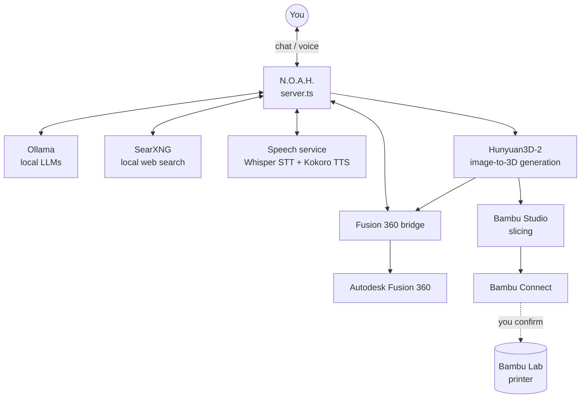

# N.O.A.H.

**Edition: 8GB** — built and tuned to run within an 8GB VRAM budget (shape-
only mesh generation, GPU-exclusive locking between Ollama and generation
tasks). A 16GB edition is planned once hardware allows for the full
texture+paint pipeline and more — see `IMAGE_GEN_ROADMAP.md`.

**N.O.A.H.** (Noel's Operational AI Helper) is a local-first AI agent — not
a chatbot wrapped around an API call. It combines conversational AI,
persistent memory, web search, speech, CAD automation, image-to-3D
generation, and 3D printing, plus supervised self-modification of its own
source code, into one system that runs entirely on your own hardware:
local LLM (via [Ollama](https://ollama.com)), local web search (via
[SearXNG](https://github.com/searxng/searxng)), local speech-to-text and
text-to-speech (Whisper + Kokoro), a CAD bridge into Autodesk Fusion 360,
and a generate-to-print pipeline onto a Bambu Lab printer. Nothing is sent
to a third-party API by default.

## What it does

- **Chat**, with a configurable personality (`personality.txt`) and
  persistent conversation memory/recall across sessions.
- **Web search**, via a self-hosted SearXNG instance — no external search
  API or key required.
- **Voice**: speech-to-text (Whisper) for input, text-to-speech (Kokoro) for
  spoken replies.
- **Fusion 360 integration**, two ways:
  - *Parametric*: describe simple geometry in words ("a 40mm cube with a
    10mm hole through it") and Noah generates and executes Fusion API code
    directly in your open document.
  - *Image-to-3D*: ask for a model of a real subject ("a model of a fox")
    and Noah finds or generates reference photos, runs them through a local
    image-to-3D model ([Hunyuan3D-2](https://github.com/Tencent/Hunyuan3D-2)),
    and imports the resulting mesh — including an experimental multiview mode
    that sources front/side/back reference photos for better geometry. See
    `IMAGE_GEN_ROADMAP.md` for where this is headed next.
- **3D printing**: a generated model can be repaired/validated, sliced with
  Bambu Studio, and sent to a Bambu Lab printer over the local network —
  Noah asks for explicit confirmation before anything actually prints. See
  `PRINTER_SETUP.md`.
- **Self-modification**: Noah can propose changes to its own source code,
  staged as a draft git branch/commit for you to review and approve or
  discard before anything touches `master`.
- **Vision** (off by default): point a webcam at Noah and he can notice when
  someone familiar — or unfamiliar — shows up, and say something about it.
  Enrollment is chat-driven: attach a photo and say "remember this face as
  X." Runs entirely locally and CPU-only. See `VISION_SETUP.md`, especially
  its Privacy section, before enabling.
- **Telegram bot**: text or send voice notes to Noah from anywhere, not just
  the local web UI, and get text + voice-note replies back — the bridge
  reuses Noah's real chat handler, so it can do everything the web UI can.
  Uses long-polling, so no public internet exposure is needed. See
  `TELEGRAM_SETUP.md`.
- **MCP tool support** (optional): connect Noah to MCP (Model Context
  Protocol) servers — spawned as local child processes, no accounts or public
  exposure — and it can call their tools mid-conversation (e.g. reading local
  files). Nothing's configured by default; this is the on-ramp for
  eventually connecting a smart-home MCP server. See `MCP_SETUP.md`.
- **Agent mode**: give Noah a goal via the header's "AGENT" button and it
  plans a rough approach, then — once you run it — works through multiple
  steps on its own (web search, any connected MCP tools), adapting based on
  what it actually finds, until it has an answer or hits its step limit.
  Runs to completion unsupervised once started (this app has no way to
  interrupt a request mid-flight), so review the preview first.

## Architecture

A single Express server (`server.ts`) fronts everything: it routes chat
requests, calls Ollama for generation, proxies SearXNG for search, talks to
the local speech service over HTTP, and dispatches Fusion 360 requests to a
bridge add-in running inside Fusion itself. The frontend (`public/`) is a
single HTML/JS page — no build step, no framework.



```
public/            chat UI (static HTML/JS)
server.ts          main server — routing, Ollama calls, all the pipelines
speech/            local Whisper (STT) + Kokoro (TTS) service
vision/            local camera + facial recognition service (off by default)
telegram.ts        Telegram bot bridge — long-polling, no public exposure
mcp.ts             MCP client — connects to configured tool servers (optional)
agent.ts           Agent mode — adaptive multi-step goal execution
ollama.ts          Standalone Ollama caller shared by agent.ts and server.ts
search.ts          Standalone web search (SearXNG) shared by agent.ts and server.ts
fusion-bridge/      Fusion 360 add-in (NoahFusionBridge) — executes CAD code
image23d/          Hunyuan3D-2, vendored, for image-to-3D generation; also
                   mesh repair (repair_mesh.py) ahead of Fusion import/print
searxng/           SearXNG config for the local search container
scripts/           startup helpers (auto-launch Ollama/SearXNG if not running)
memories/          conversation history/recall (gitignored — personal data)
```

## Setup

See [`GETTING_STARTED.md`](GETTING_STARTED.md) for a full walkthrough —
prerequisites, cloning, pulling the Ollama models Noah expects, and which
of the optional subsystems below you actually need. Each subsystem also
has its own detailed one-time setup doc:

1. [`SEARXNG_SETUP.md`](SEARXNG_SETUP.md) — local search container
2. [`SPEECH_SETUP.md`](SPEECH_SETUP.md) — Whisper + Kokoro venv
3. [`FUSION_SETUP.md`](FUSION_SETUP.md) — the Fusion 360 add-in
4. [`HUNYUAN3D_SETUP.md`](HUNYUAN3D_SETUP.md) — the Hunyuan3D-2 venv
5. [`PRINTER_SETUP.md`](PRINTER_SETUP.md) — slicing + printing on a Bambu Lab printer
6. [`VISION_SETUP.md`](VISION_SETUP.md) — camera-based facial recognition (off by default — read its Privacy section first)
7. [`TELEGRAM_SETUP.md`](TELEGRAM_SETUP.md) — text/voice-note chat with Noah from anywhere
8. [`MCP_SETUP.md`](MCP_SETUP.md) — connect MCP servers for tool use (optional)

`npm run dev` uses `tsx watch` and auto-reloads on file changes — what you
want day to day. `npm start` runs the compiled build (`npm run build`
first) instead.

## Security assumption

Noah's server has **no authentication** — `app.listen(PORT)` accepts any
request that reaches it. That's a deliberate trade-off for a single-user
localhost tool, not an oversight, but it means several endpoints are more
privileged than they might look at a glance: the Fusion 360 bridge executes
generated code directly inside Fusion, and the self-modification
approve/reject endpoints perform real git operations (branch, commit,
merge) with no check on who's asking.

**Noah is designed to run on `localhost`, trusted by exactly one person —
you.** Don't expose port 3000 (or the Fusion bridge's port 9000) to your
LAN or the internet without adding real authentication first; nothing here
currently stops another device on your network from using either endpoint
as if it were you.

## Hardware notes

Image-to-3D generation and the full Ollama/Whisper stack are VRAM-hungry.
An 8GB card runs the core assistant and shape-only mesh generation fine;
Hunyuan3D's full texture+paint pipeline wants closer to 16GB. GPU-exclusive
locking keeps generation tasks from fighting Ollama for VRAM on smaller
cards — see the comments around `withGpuExclusive` in `server.ts`.
