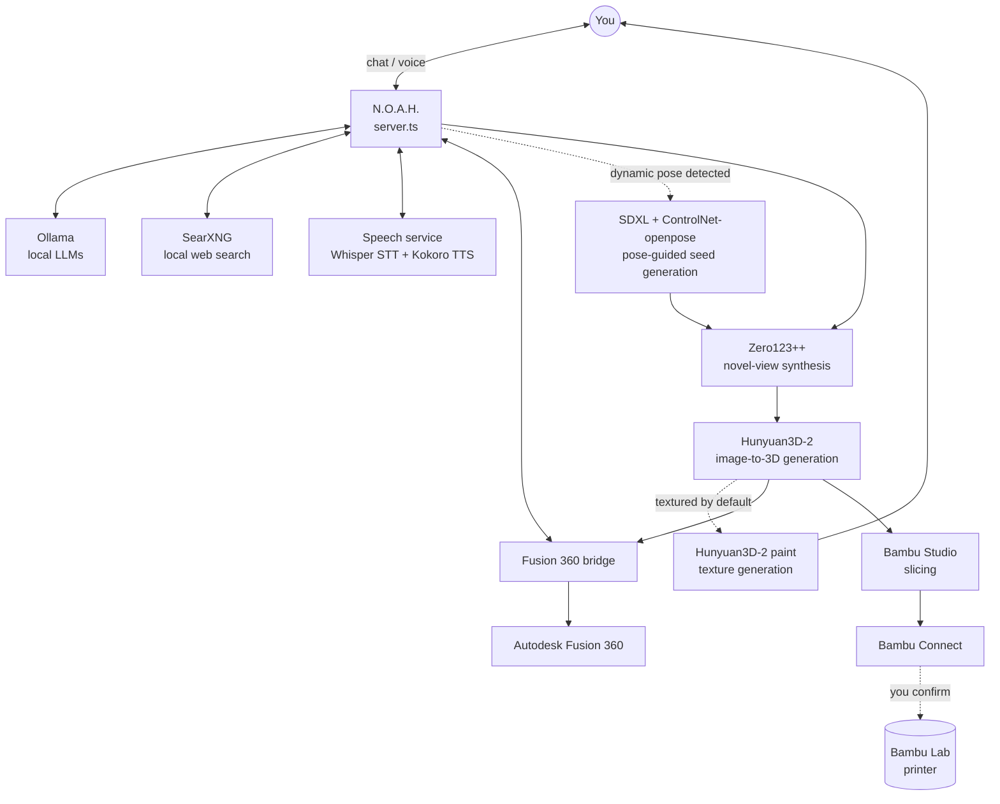

# N.O.A.H.

**Edition: 16GB** — runs on a 16GB card, which unlocked novel-view
synthesis, pose-guided seed generation (including attaching your own
reference image to drive a specific dynamic pose), and full texture+paint
for the image-to-3D pipeline (see `IMAGE_GEN_ROADMAP.md`) — generated
models are now genuinely colored/textured, not bare grey geometry. Worth
knowing: texture quality is now good, but raw shape/geometry fidelity
(fingers, faces) has a real, honest ceiling on this model generation —
see `IMAGE_GEN_ROADMAP.md`'s "What this fixes vs. doesn't" for why.

The 8GB-constrained state (shape-only mesh generation, no local
novel-view model) is preserved at the `noah-8gb-edition` git tag —
`git checkout noah-8gb-edition` for that edition. It's not a frozen
snapshot: VRAM-independent fixes and features (chat-driven mesh editing —
scale/mirror/simplify/fill-holes on a generated model — plus general bug
fixes) get backported there too, since there's no reason to withhold
those from an 8GB card. Only the genuinely 16GB-hungry generation stages
above are excluded. The `8gb-edition` branch is where that backporting
happens; the tag marks its latest released state.

**N.O.A.H.** (Noel's Operational AI Helper) is a local-first AI agent — not
a chatbot wrapped around an API call. It combines conversational AI,
persistent memory, web search, speech, CAD automation, image-to-3D
generation, and 3D printing, plus supervised self-modification of its own
source code, into one system that runs entirely on your own hardware:
local LLM (via [Ollama](https://ollama.com)), local web search (via
[SearXNG](https://github.com/searxng/searxng)), local speech-to-text and
text-to-speech (Whisper + Kokoro), a CAD bridge into Autodesk Fusion 360,
and a generate-to-print pipeline onto a Bambu Lab printer. Nothing is sent
to a third-party API by default.

## What it does

- **Chat**, with a configurable personality (`personality.txt`) and
  persistent conversation memory/recall across sessions.
- **Web search**, via a self-hosted SearXNG instance — no external search
  API or key required.
- **Voice**: speech-to-text (Whisper) for input, text-to-speech (Kokoro) for
  spoken replies.
- **Fusion 360 integration**, two ways:
  - *Parametric*: describe simple geometry in words ("a 40mm cube with a
    10mm hole through it") and Noah generates and executes Fusion API code
    directly in your open document.
  - *Image-to-3D*: ask for a model of a real subject ("a model of a fox")
    and Noah finds or generates a reference photo, runs it through a local
    image-to-3D model ([Hunyuan3D-2](https://github.com/Tencent/Hunyuan3D-2)),
    and imports the resulting mesh — including a multiview mode that
    generates consistent side/back views from that one verified photo
    ([Zero123++](https://huggingface.co/sudo-ai/zero123plus-v1.2)) for
    better geometry than a single angle alone. A search-sourced photo caught
    mid-action ("a model of spiderman swinging") gets its pose replaced
    with a cleanly generated neutral-pose image (SDXL + ControlNet-openpose)
    before that step, rather than feeding an unreliable action pose in
    directly. Models are textured/colored by default (Hunyuan3D-2's own
    paint pipeline) — say "shape only" or "no texture" for the older,
    faster bare-geometry path. See `IMAGE_GEN_ROADMAP.md` for the full
    pipeline and what's headed next.
- **3D printing**: a generated model can be repaired/validated, sliced with
  Bambu Studio, and sent to a Bambu Lab printer over the local network —
  Noah asks for explicit confirmation before anything actually prints. See
  `PRINTER_SETUP.md`.
- **Self-modification**: Noah can propose changes to its own source code,
  staged as a draft git branch/commit for you to review and approve or
  discard before anything touches `master`.

## Architecture

A single Express server (`server.ts`) fronts everything: it routes chat
requests, calls Ollama for generation, proxies SearXNG for search, talks to
the local speech service over HTTP, and dispatches Fusion 360 requests to a
bridge add-in running inside Fusion itself. The frontend (`public/`) is a
single HTML/JS page — no build step, no framework.



```
public/            chat UI (static HTML/JS)
server.ts          main server — routing, Ollama calls, all the pipelines
speech/            local Whisper (STT) + Kokoro (TTS) service
fusion-bridge/      Fusion 360 add-in (NoahFusionBridge) — executes CAD code
image23d/          Hunyuan3D-2, vendored, for image-to-3D generation; also
                   mesh repair (repair_mesh.py) ahead of Fusion import/print
searxng/           SearXNG config for the local search container
scripts/           startup helpers (auto-launch Ollama/SearXNG if not running)
memories/          conversation history/recall (gitignored — personal data)
```

## Setup

See [`GETTING_STARTED.md`](GETTING_STARTED.md) for a full walkthrough —
prerequisites, cloning, pulling the Ollama models Noah expects, and which
of the optional subsystems below you actually need. Each subsystem also
has its own detailed one-time setup doc:

1. [`SEARXNG_SETUP.md`](SEARXNG_SETUP.md) — local search container
2. [`SPEECH_SETUP.md`](SPEECH_SETUP.md) — Whisper + Kokoro venv
3. [`FUSION_SETUP.md`](FUSION_SETUP.md) — the Fusion 360 add-in
4. [`HUNYUAN3D_SETUP.md`](HUNYUAN3D_SETUP.md) — the Hunyuan3D-2 venv
5. [`PRINTER_SETUP.md`](PRINTER_SETUP.md) — slicing + printing on a Bambu Lab printer

`npm run dev` uses `tsx watch` and auto-reloads on file changes — what you
want day to day. `npm start` runs the compiled build (`npm run build`
first) instead.

## Security assumption

Noah's server has **no authentication** — `app.listen(PORT)` accepts any
request that reaches it. That's a deliberate trade-off for a single-user
localhost tool, not an oversight, but it means several endpoints are more
privileged than they might look at a glance: the Fusion 360 bridge executes
generated code directly inside Fusion, and the self-modification
approve/reject endpoints perform real git operations (branch, commit,
merge) with no check on who's asking.

**Noah is designed to run on `localhost`, trusted by exactly one person —
you.** Don't expose port 3000 (or the Fusion bridge's port 9000) to your
LAN or the internet without adding real authentication first; nothing here
currently stops another device on your network from using either endpoint
as if it were you.

## Hardware notes

Image-to-3D generation and the full Ollama/Whisper stack are VRAM-hungry.
Noah currently runs on a single 16GB card (RTX 5060 Ti); an 8GB card runs
the core assistant and shape-only mesh generation fine but can't fit local
novel-view synthesis alongside Ollama (see the `noah-8gb-edition` tag for
that state). GPU-exclusive locking still keeps generation tasks from
fighting Ollama for VRAM even on 16GB — see the comments around
`withGpuExclusive` in `server.ts` for why it's kept rather than removed.
Four generation steps can now run back-to-back in one request (shape ~6GB,
novel-view synthesis ~5GB, pose-guided seed generation ~8GB, texture+paint
~7.2GB — all measured live, not estimated), each releasing its VRAM before
the next starts.
